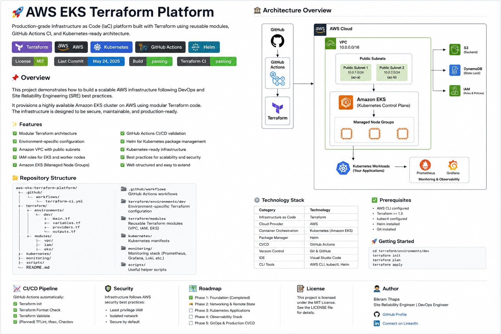

# 🚀 AWS EKS Terraform Platform

> Production-oriented AWS EKS platform built with Terraform, Kubernetes, Helm, Prometheus/Grafana, Argo CD GitOps, multi-environment infrastructure, secure remote state, GitHub OIDC architecture, and automated GitHub Actions CI/CD validation.

---

## 📌 Overview

This project demonstrates the design and implementation of a modular AWS Kubernetes platform following DevOps and Site Reliability Engineering (SRE) practices.

The platform combines Infrastructure as Code, Kubernetes workload management, Helm packaging, observability, GitOps, security scanning, multi-environment infrastructure, secure Terraform state management, GitHub OIDC authentication architecture, and automated CI/CD validation.

### Current Implementation

- Modular Terraform architecture
- Development, staging, and production environments
- Environment-specific Terraform configuration
- Secure Terraform remote state architecture
- Amazon S3 Terraform state backend
- Native S3 state locking
- Customer-managed AWS KMS encryption for Terraform state
- S3 versioning and public access protection
- Amazon VPC networking
- IAM roles for EKS
- Amazon EKS
- EKS Managed Node Groups
- AWS KMS encryption for EKS secrets
- Kubernetes workloads
- Horizontal Pod Autoscaling
- PodDisruptionBudget
- Kubernetes Ingress
- AWS Load Balancer Controller with IRSA
- ExternalDNS with Amazon Route53 and IRSA
- cert-manager with Route53 DNS01 and IRSA
- Least-privilege Route53 hosted-zone permissions
- AWS ALB Ingress
- ACM HTTPS termination
- Production-style sample application
- Reusable Helm chart
- Prometheus monitoring
- Grafana visualization
- Alertmanager
- Prometheus alerting rules
- ServiceMonitor configuration
- Loki centralized logging
- Grafana Alloy log collection
- Kubernetes pod log collection
- Kubernetes event collection
- Grafana Loki data-source integration
- Argo CD GitOps
- Environment-specific Helm values
- GitHub Actions CI/CD
- Multi-environment Terraform CI matrix
- Pull Request Terraform validation
- Credential-safe Terraform PR checks
- GitHub Actions OIDC Terraform configuration
- AWS IAM OIDC trust-policy configuration
- Terraform CI validation for GitHub OIDC configuration
- TFLint
- Trivy IaC security scanning
- Kubeconform schema validation
- Dedicated Logging CI validation

> **Note:** The GitHub OIDC and AWS IAM configuration is implemented and validated as Terraform code. Deployment to AWS and real AWS-backed Terraform planning remain pending until an AWS account and AWS resources are available.

---

## 🏗 Architecture



### Architecture Flow

```text
                         GitHub
                            │
                            ▼
                     GitHub Actions
                            │
             ┌──────────────┼──────────────┐
             │              │              │
             ▼              ▼              ▼
        Terraform CI   Kubernetes CI   Component CI
             │
             ▼
          Terraform
             │
      ┌──────┼──────┐
      ▼      ▼      ▼
     Dev   Staging  Prod
             │
             ▼
          AWS VPC
             │
             ▼
         Amazon EKS
             │
    ┌────────┼───────────┬──────────────┐
    │        │           │              │
    ▼        ▼           ▼              ▼
ALB Controller  ExternalDNS  cert-manager  Observability
    │              │             │             │
    │              ▼             ▼             ├── Prometheus
    │           Route53      Route53 DNS01      ├── Grafana
    │                                          ├── Loki
    ▼                                          └── Tempo
AWS ALB
    │
    ├── ACM TLS
    │
    ▼
Sample Application
    │
    ├── Deployment
    ├── Service
    ├── HPA
    └── PodDisruptionBudget
```

The architecture separates infrastructure provisioning, application deployment, GitOps delivery, observability, CI/CD validation, and cloud authentication concerns.

### Traffic, DNS & TLS Flow

For public application traffic, the AWS Load Balancer Controller provisions an internet-facing Application Load Balancer from the Kubernetes Ingress configuration. ExternalDNS watches the Ingress hostname and manages the corresponding Route53 DNS record.

HTTPS termination for the sample ALB-based application uses an AWS Certificate Manager certificate referenced by the Ingress. cert-manager remains available as a separate platform capability for workloads that require Kubernetes-managed TLS certificates and Route53 DNS01 ACME validation.

```text
Client
  │
  ▼
Route53
  │
  ▼
AWS Application Load Balancer
  │
  ├── ACM Certificate / HTTPS
  │
  ▼
Kubernetes Service
  │
  ▼
Sample Application Pods

ExternalDNS ─────► Route53 DNS records
cert-manager ────► Route53 DNS01 challenges
```

---

## 📂 Repository Structure

```text
aws-eks-terraform-platform/
│
├── .github/
│   └── workflows/
│       ├── terraform-ci.yml
│       ├── terraform-plan-pr.yml
│       ├── kubernetes-ci.yml
│       ├── helm-ci.yml
│       ├── monitoring-ci.yml
│       ├── logging-ci.yml
│       ├── opentelemetry-ci.yml
│       ├── tracing-ci.yml
│       ├── dashboard-ci.yml
│       ├── alerting-ci.yml
│       ├── aws-load-balancer-controller-ci.yml
│       ├── external-dns-ci.yml
│       ├── cert-manager-ci.yml
│       ├── sample-app-ci.yml
│       └── gitops-ci.yml
├── architecture/
│   └── aws-eks-architecture.png
│
├── terraform/
│   ├── bootstrap/
│   │   ├── main.tf
│   │   ├── variables.tf
│   │   └── outputs.tf
│   │
│   ├── github-oidc/
│   │   ├── main.tf
│   │   ├── variables.tf
│   │   ├── outputs.tf
│   │   └── versions.tf
│   │
│   ├── environments/
│   │   ├── dev/
│   │   │   ├── backend.tf
│   │   │   ├── main.tf
│   │   │   ├── outputs.tf
│   │   │   ├── providers.tf
│   │   │   └── variables.tf
│   │   │
│   │   ├── staging/
│   │   │   ├── backend.tf
│   │   │   ├── main.tf
│   │   │   ├── outputs.tf
│   │   │   ├── providers.tf
│   │   │   └── variables.tf
│   │   │
│   │   └── prod/
│   │       ├── backend.tf
│   │       ├── main.tf
│   │       ├── outputs.tf
│   │       ├── providers.tf
│   │       └── variables.tf
│   │
│   └── modules/
│       ├── aws-load-balancer-controller-irsa/
│       ├── cert-manager-irsa/
│       ├── eks/
│       ├── external-dns-irsa/
│       ├── iam/
│       └── vpc/
│
├── kubernetes/
│   ├── aws-load-balancer-controller/
│   │   └── values.yaml
│   ├── cert-manager/
│   │   ├── cluster-issuer.yaml
│   │   └── values.yaml
│   ├── external-dns/
│   │   └── values.yaml
│   ├── sample-app/
│   │   ├── deployment.yaml
│   │   ├── service.yaml
│   │   ├── ingress.yaml
│   │   ├── hpa.yaml
│   │   └── pdb.yaml
│   ├── namespace.yaml
│   ├── configmap.yaml
│   ├── deployment.yaml
│   ├── service.yaml
│   ├── ingress.yaml
│   ├── hpa.yaml
│   └── pdb.yaml
│
├── helm/
│   └── sre-demo/
│       ├── Chart.yaml
│       ├── values.yaml
│       └── templates/
│           ├── configmap.yaml
│           ├── deployment.yaml
│           ├── service.yaml
│           ├── ingress.yaml
│           ├── hpa.yaml
│           └── pdb.yaml
│
├── monitoring/
│   ├── kube-prometheus-stack/
│   │   └── values.yaml
│   ├── loki/
│   │   └── values.yaml
│   ├── alloy/
│   │   └── values.yaml
│   ├── opentelemetry/
│   │   └── values.yaml
│   ├── tempo/
│   │   └── values.yaml
│   ├── dashboards/
│   │   ├── sre-platform-overview.json
│   │   └── sre-platform-overview-configmap.yaml
│   ├── rules/
│   │   └── sre-demo-rules.yaml
│   └── servicemonitors/
│       └── sre-demo-servicemonitor.yaml
├── gitops/
│   ├── argocd/
│   │   └── sre-demo-application.yaml
│   └── environments/
│       └── dev/
│           └── values.yaml
│
└── README.md
```

---

## 🚀 Platform Capabilities

### Infrastructure

- Infrastructure as Code with Terraform
- Reusable Terraform modules
- Development, staging, and production environments
- Environment-specific configuration
- Environment-specific VPC networking
- Independent Terraform state per environment
- Secure S3 remote-state architecture
- Native S3 state locking
- Customer-managed AWS KMS encryption
- S3 state versioning
- S3 Block Public Access
- IAM roles and policy attachments
- Amazon EKS
- EKS Managed Node Groups
- Private EKS API access
- AWS KMS encryption for Kubernetes secrets
- AWS Load Balancer Controller with IRSA
- ExternalDNS integration with Amazon Route53
- cert-manager with Route53 DNS01 support
- IAM Roles for Service Accounts (IRSA)
- Least-privilege Route53 hosted-zone access
- Environment-specific Route53 zone configuration
- AWS ALB Ingress integration
- ACM-based HTTPS termination
- Automated DNS record management through ExternalDNS

---

### Multi-Environment Architecture

The Terraform platform supports separate development, staging, and production environments while sharing reusable infrastructure modules.

```text
terraform/environments/
├── dev/
├── staging/
└── prod/
```

Each environment provides:

- Independent Terraform state
- Separate EKS cluster naming
- Environment-specific VPC CIDR ranges
- Environment-specific worker-node sizing
- Shared reusable Terraform modules
- Independent validation through the Terraform CI matrix
- Independent Pull Request validation

### Environment Strategy

| Environment | Cluster | VPC CIDR | Node Type |
|-------------|---------|----------|-----------|
| Development | `sre-platform-dev` | `10.0.0.0/16` | `t3.small` |
| Staging | `sre-platform-staging` | `10.1.0.0/16` | `t3.small` |
| Production | `sre-platform-prod` | `10.2.0.0/16` | `t3.medium` |

Production uses larger worker nodes and higher scaling capacity than development and staging.

---

## 🗄 Terraform Remote State

The project includes a dedicated bootstrap configuration for secure Terraform remote-state management.

Implemented architecture includes:

- Amazon S3 remote-state backend
- Separate state keys for development, staging, and production
- S3 object versioning
- Native Terraform state locking using `use_lockfile`
- Customer-managed AWS KMS encryption
- AWS KMS key rotation
- S3 Block Public Access
- Dedicated bootstrap Terraform configuration

State is logically separated by environment:

```text
eks/dev/terraform.tfstate
eks/staging/terraform.tfstate
eks/prod/terraform.tfstate
```

This prevents development, staging, and production environments from sharing the same Terraform state.

> Remote-state infrastructure is represented in Terraform code. Actual AWS deployment requires an AWS account.

---

## ☸️ Kubernetes

The Kubernetes layer includes:

- Namespace isolation
- Deployments
- ConfigMaps
- ClusterIP Services
- Ingress
- Horizontal Pod Autoscaling
- PodDisruptionBudget
- Resource requests and limits
- Readiness probes
- Liveness probes

---

## 📦 Helm

The application deployment layer includes:

- Reusable application Helm chart
- Environment-specific values
- Helm linting
- Template rendering
- Kubernetes schema validation

The reusable Helm chart is located at:

```text
helm/sre-demo/
```

---

## 📈 Observability

The observability architecture includes:

- Prometheus
- Grafana
- Alertmanager
- kube-state-metrics
- Node Exporter
- ServiceMonitor
- PrometheusRule
- Application availability alerts

### Monitoring Flow

```text
Kubernetes Workloads
        │
        ▼
  ServiceMonitor
        │
        ▼
    Prometheus
        │
   ┌────┴────┐
   ▼         ▼
Grafana   Alertmanager
             │
             ▼
       PrometheusRule
```

Prometheus collects Kubernetes and application metrics, Grafana provides visualization, and Alertmanager provides the foundation for operational alerting.

---

### Alerting & Incident Routing

The monitoring platform includes severity-based alert routing and inhibition using Prometheus and Alertmanager.

The alerting implementation includes:

- Custom Prometheus alert rules
- Critical, warning, and info severity levels
- Default Alertmanager receiver
- Critical severity receiver
- Warning severity receiver
- Info severity receiver
- Severity-based Alertmanager routing
- Alert grouping by namespace, alert name, and severity
- Alert repeat interval configuration
- Critical alert inhibition of lower-severity alerts
- Warning alert inhibition of informational alerts
- Application availability alerting
- Deployment degradation alerting
- Container restart monitoring
- Alertmanager configuration validation
- Dedicated Alerting CI workflow
- Alerting CI validation on the `main` branch

#### Alert Routing Flow

```text
Prometheus
    │
    ▼
PrometheusRule
    │
    ▼
Alertmanager
    │
    ├── Critical ──► Critical Receiver
    │
    ├── Warning  ──► Warning Receiver
    │
    ├── Info     ──► Info Receiver
    │
    └── Default  ──► Default Receiver
```

Alert inhibition prevents lower-severity notifications from creating unnecessary noise when a higher-severity alert for the same affected resource is already firing.

---

## 🔄 GitOps

Argo CD provides the GitOps deployment layer.

```text
GitHub Repository
       │
       ▼
     Argo CD
       │
       ▼
Environment Values
       │
       ▼
   Helm Chart
       │
       ▼
 Kubernetes / EKS
```


The Argo CD configuration enables:

- Automated synchronization
- Self-healing
- Automatic pruning
- Environment-specific configuration
- Declarative Kubernetes deployments
- Automatic namespace creation

---

## 🔐 GitHub Actions OIDC Architecture

The repository includes Terraform configuration for establishing secure GitHub Actions authentication to AWS using OpenID Connect (OIDC).

The configuration is located at:

```text
terraform/github-oidc/
```

It defines the architecture for:

- GitHub Actions OIDC identity provider
- AWS IAM role for GitHub Actions
- `sts:AssumeRoleWithWebIdentity`
- Repository-restricted trust policy
- Pull Request trust conditions
- Main-branch trust conditions
- Terraform state read access
- KMS decrypt/describe access
- AWS read-only access for planning
- Temporary AWS credential architecture

### Target Authentication Flow

```text
GitHub Actions
      │
      │ OIDC Token
      ▼
AWS IAM OIDC Provider
      │
      ▼
AWS STS
      │
      │ AssumeRoleWithWebIdentity
      ▼
GitHub Actions IAM Role
      │
      ▼
Temporary AWS Credentials
      │
      ├── Read Terraform State
      ├── Read AWS Infrastructure
      └── Generate Terraform Plan
```

### Why OIDC?

The target design avoids storing long-lived AWS access keys in GitHub.

Instead of configuring permanent credentials such as:

```text
AWS_ACCESS_KEY_ID
AWS_SECRET_ACCESS_KEY
```

GitHub Actions will authenticate through OIDC and receive temporary AWS credentials through AWS STS.

### Current OIDC Status

| Capability | Status |
|------------|--------|
| Terraform OIDC configuration | ✅ Complete |
| GitHub OIDC provider resource | ✅ Defined |
| AWS IAM role configuration | ✅ Defined |
| Repository-restricted trust policy | ✅ Defined |
| Main branch trust condition | ✅ Defined |
| Pull Request trust condition | ✅ Defined |
| Terraform state access policy | ✅ Defined |
| KMS access policy | ✅ Defined |
| Terraform CI validation | ✅ Passing |
| Actual AWS OIDC provider deployment | ⏳ Pending AWS account |
| Actual AWS IAM role deployment | ⏳ Pending AWS account |
| GitHub → AWS authentication test | ⏳ Pending AWS account |
| AWS-backed Terraform Plan | ⏳ Pending AWS account |

This allows the security architecture to be developed and validated independently before connecting the project to a live AWS environment.

---

## ⚙️ Technology Stack

| Category | Technology |
|----------|------------|
| Cloud | AWS |
| Infrastructure as Code | Terraform |
| Container Orchestration | Kubernetes / Amazon EKS |
| Package Management | Helm |
| GitOps | Argo CD |
| Monitoring | Prometheus |
| Visualization | Grafana |
| Centralized Logging | Grafana Loki |
| Log Collection | Grafana Alloy |
| Log Querying | LogQL |
| Distributed Tracing | OpenTelemetry / Grafana Tempo |
| Telemetry Protocol | OTLP gRPC / HTTP |
| Dashboards as Code | Grafana JSON / Kubernetes ConfigMap |
| Alerting | Alertmanager |
| CI/CD | GitHub Actions |
| Cloud Authentication | GitHub Actions OIDC / AWS STS |
| Terraform Linting | TFLint |
| Security Scanning | Trivy |
| Kubernetes Validation | Kubeconform |
| Terraform State | Amazon S3 |
| State Encryption | AWS KMS |
| Version Control | Git / GitHub |
| IDE | Visual Studio Code |

---

## 🔐 Security

The project incorporates infrastructure, Terraform-state, CI/CD, Kubernetes, and cloud-authentication security controls.

### Infrastructure Security

- Private EKS API endpoint
- AWS KMS encryption for Kubernetes secrets
- IAM-based AWS access
- Environment isolation

### Terraform State Security

- Customer-managed KMS encryption
- KMS key rotation
- S3 Block Public Access
- S3 state versioning
- Native S3 Terraform state locking
- Independent state per environment

### CI/CD Security

- Terraform security scanning with Trivy
- Terraform linting with TFLint
- Kubernetes schema validation
- Pull Request validation
- Credential-safe Terraform PR checks
- GitHub OIDC architecture
- Repository-restricted IAM trust policy
- No long-lived AWS credentials required by the target CI/CD architecture

### Kubernetes Security

- Resource requests and limits
- Namespace isolation
- Readiness probes
- Liveness probes
- PodDisruptionBudget
- CI validation before infrastructure changes are merged

---

## ✅ CI/CD & Validation

The repository contains automated GitHub Actions workflows covering the platform stack.

| Workflow | Purpose |
|----------|---------|
| Terraform CI | Matrix-based Terraform validation for dev, staging, and prod with TFLint and Trivy security scanning |
| Terraform Plan PR | Credential-safe Terraform validation for dev, staging, and prod on Pull Requests |
| Kubernetes CI | Kubernetes manifest validation using Kubeconform |
| Helm CI | Helm linting, template rendering, and schema validation |
| Monitoring CI | Prometheus/Grafana stack rendering and configuration validation |
| Logging CI | Loki, Grafana Alloy, and monitoring-stack Helm rendering with Kubeconform validation |
| OpenTelemetry CI | OpenTelemetry Collector Helm rendering and Kubernetes schema validation |
| Tracing CI | Grafana Tempo, OpenTelemetry Collector, Tempo Grafana data source, and integrated tracing validation |
| Dashboard CI | Grafana dashboard JSON, ConfigMap, dashboard sidecar, and monitoring-stack validation |
| Alerting CI | Prometheus alert rules, Alertmanager severity routing, inhibition rules, and monitoring-stack validation |
| GitOps CI | Argo CD and environment-specific Helm configuration validation |

---

## 🧱 Terraform CI Matrix

Terraform CI uses a GitHub Actions matrix strategy to validate all three infrastructure environments.

```text
Terraform CI
    │
    ├── Development
    │     ├── Terraform Init
    │     ├── Terraform Format
    │     ├── Terraform Validate
    │     ├── TFLint
    │     └── Trivy
    │
    ├── Staging
    │     ├── Terraform Init
    │     ├── Terraform Format
    │     ├── Terraform Validate
    │     ├── TFLint
    │     └── Trivy
    │
    ├── Production
    │     ├── Terraform Init
    │     ├── Terraform Format
    │     ├── Terraform Validate
    │     ├── TFLint
    │     └── Trivy
    │
    └── GitHub OIDC
          ├── Terraform Init
          ├── Terraform Format
          └── Terraform Validate
```

The matrix strategy validates the three infrastructure environments consistently, while the GitHub OIDC Terraform root is validated through its own CI job.

---

## 🔀 Pull Request Terraform Validation

Terraform infrastructure changes are validated before they are merged into the `main` branch.

The Pull Request workflow runs independently for all three Terraform environments:

```text
Feature Branch
      │
      ▼
Pull Request
      │
      ▼
Terraform PR Checks
      │
      ├── Development
      ├── Staging
      └── Production
      │
      ▼
Terraform Init
      │
      ▼
Terraform Format Check
      │
      ▼
Terraform Validate
      │
      ▼
PR Checks Pass
      │
      ▼
Merge to Main
```

### PR Validation Strategy

The current Pull Request workflow performs credential-safe Terraform checks without requiring long-lived AWS credentials.

For each environment, the workflow performs:

- Terraform initialization for validation
- Terraform formatting checks
- Terraform configuration validation
- Independent matrix execution for dev, staging, and prod
- Pull Request status checks before merge

The remote backend is not used during credential-free PR validation because accessing the real S3 backend requires AWS authentication.

Once AWS OIDC deployment is available, this workflow can be extended to authenticate to AWS and execute real Terraform plans.

### Current PR Validation Coverage

| Environment | PR Validation |
|-------------|---------------|
| Development | ✅ Enabled |
| Staging | ✅ Enabled |
| Production | ✅ Enabled |

---

## 🔮 Target Terraform Plan Workflow

Once an AWS account is connected and the OIDC infrastructure is deployed, the target Pull Request workflow will become:

```text
Developer
    │
    ▼
Feature Branch
    │
    ▼
Pull Request
    │
    ▼
Terraform Format
    │
    ▼
Terraform Validate
    │
    ▼
TFLint
    │
    ▼
Trivy
    │
    ▼
GitHub OIDC
    │
    ▼
AWS STS AssumeRole
    │
    ▼
Temporary AWS Credentials
    │
    ▼
Remote State Access
    │
    ▼
Terraform Plan
    │
    ▼
Engineer Reviews Plan
    │
    ▼
PR Approval
    │
    ▼
Merge
```

The actual AWS-backed Terraform Plan is intentionally not marked complete because no live AWS account is currently connected to the project.

---

## 🔄 Overall CI Pipeline

```text
Developer
    │
    ▼
Feature Branch
    │
    ▼
Pull Request
    │
    ▼
Terraform PR Validation
    │
    ├── Dev
    ├── Staging
    └── Prod
    │
    ▼
PR Approval / Merge
    │
    ▼
Main Branch
    │
    ▼
GitHub Actions
    │
    ┌──────────────────┬──────────────────┐
    │                  │                  │
    ▼                  ▼                  ▼
Terraform CI      Kubernetes CI        Helm CI
    │                  │                  │
    ├── Dev            ▼                  ▼
    ├── Staging    Kubeconform         helm lint
    ├── Prod                          helm template
    └── OIDC
    │
    ├── TFLint
    └── Trivy
           │
           └──────────────┬───────────────┘
                          │
                   ┌──────┴──────┐
                   ▼             ▼
             Monitoring CI    GitOps CI
                   │             │
                   ▼             ▼
             Prometheus /      Argo CD
                Grafana        Helm Values
```

---

## 🧪 Local Validation

### Terraform Formatting

Format all Terraform code:

```bash
terraform fmt -recursive
```

Verify formatting:

```bash
terraform fmt -check -recursive
```

### Development

```bash
terraform -chdir=terraform/environments/dev init -backend=false
terraform -chdir=terraform/environments/dev validate
```

### Staging

```bash
terraform -chdir=terraform/environments/staging init -backend=false
terraform -chdir=terraform/environments/staging validate
```

### Production

```bash
terraform -chdir=terraform/environments/prod init -backend=false
terraform -chdir=terraform/environments/prod validate
```

### GitHub OIDC

```bash
terraform -chdir=terraform/github-oidc init -backend=false
terraform -chdir=terraform/github-oidc validate
```

Expected result:

```text
Success! The configuration is valid.
```

> Do not run `terraform apply` for the GitHub OIDC configuration until a real AWS account and account-specific values are configured.

### Remote-State Bootstrap

```bash
terraform -chdir=terraform/bootstrap init
terraform -chdir=terraform/bootstrap validate
```

---

## ☸️ Kubernetes Validation

```bash
kubeconform -strict -summary kubernetes/*.yaml
```

Expected result:

```text
Valid: 7
Invalid: 0
Errors: 0
Skipped: 0
```

---

## 📦 Helm Validation

Lint the application chart:

```bash
helm lint helm/sre-demo
```

Render the chart:

```bash
helm template sre-demo helm/sre-demo \
  > /tmp/sre-demo-rendered.yaml
```

Validate rendered resources:

```bash
kubeconform -strict -summary /tmp/sre-demo-rendered.yaml
```

---

## 📊 Monitoring Validation

Add the Prometheus Community Helm repository:

```bash
helm repo add prometheus-community \
  https://prometheus-community.github.io/helm-charts

helm repo update
```

Render the monitoring stack:

```bash
helm template monitoring \
  prometheus-community/kube-prometheus-stack \
  --namespace monitoring \
  -f monitoring/kube-prometheus-stack/values.yaml \
  > /tmp/monitoring-rendered.yaml
```

---

## 🔄 GitOps Validation

Render the application using the development GitOps values:

```bash
helm template sre-demo helm/sre-demo \
  -f gitops/environments/dev/values.yaml \
  > /tmp/gitops-rendered.yaml
```

Validate:

```bash
kubeconform -strict -summary /tmp/gitops-rendered.yaml
```

---

## 🗺 Roadmap

### Phase 1 — Infrastructure ✅

- [x] Modular Terraform
- [x] Environment structure
- [x] AWS VPC
- [x] IAM
- [x] Amazon EKS
- [x] Managed Node Groups
- [x] KMS encryption

### Phase 2 — CI & Security ✅

- [x] GitHub Actions
- [x] Terraform validation
- [x] TFLint
- [x] Trivy security scanning

### Phase 3 — Kubernetes & Helm ✅

- [x] Kubernetes workloads
- [x] Horizontal Pod Autoscaling
- [x] PodDisruptionBudget
- [x] Ingress
- [x] Helm chart
- [x] Kubernetes CI
- [x] Helm CI

### Phase 4 — Observability ✅

- [x] Prometheus
- [x] Grafana
- [x] Alertmanager
- [x] ServiceMonitor
- [x] PrometheusRule
- [x] Monitoring CI

### Phase 5 — GitOps ✅

- [x] Argo CD
- [x] GitOps environment configuration
- [x] Automated synchronization
- [x] Self-healing
- [x] GitOps CI

### Phase 6 — Multi-Environment & Terraform State ✅

- [x] Development environment
- [x] Staging environment
- [x] Production environment
- [x] Multi-environment Terraform CI matrix
- [x] Amazon S3 remote-state architecture
- [x] Separate state per environment
- [x] Native S3 state locking
- [x] S3 state versioning
- [x] Customer-managed KMS state encryption
- [x] KMS key rotation
- [x] S3 Block Public Access
- [x] Terraform backend bootstrap configuration

### Phase 7 — Pull Request Automation ✅

- [x] Terraform Pull Request workflow
- [x] Development PR validation
- [x] Staging PR validation
- [x] Production PR validation
- [x] Multi-environment PR matrix
- [x] Terraform initialization for PR validation
- [x] Terraform format checks
- [x] Terraform configuration validation
- [x] Credential-safe Pull Request checks
- [x] PR checks before merge

### Phase 8 — GitHub OIDC & AWS Authentication 🚧

#### Configuration Complete

- [x] GitHub OIDC Terraform root
- [x] GitHub OIDC identity-provider resource
- [x] AWS IAM role configuration
- [x] `AssumeRoleWithWebIdentity` trust policy
- [x] Repository-restricted OIDC trust
- [x] Main branch trust condition
- [x] Pull Request trust condition
- [x] Terraform state access policy
- [x] KMS state-access policy
- [x] GitHub OIDC Terraform CI job
- [x] OIDC Terraform initialization
- [x] OIDC Terraform formatting validation
- [x] OIDC Terraform configuration validation

#### AWS Deployment Pending

- [ ] Create/connect AWS account
- [ ] Deploy GitHub OIDC provider to AWS
- [ ] Deploy GitHub Actions IAM role
- [ ] Configure real Terraform state bucket value
- [ ] Configure real KMS key ARN
- [ ] Configure GitHub Actions `id-token: write`
- [ ] Configure AWS role assumption in GitHub Actions
- [ ] Verify GitHub → AWS OIDC authentication
- [ ] Enable remote-state access from CI
- [ ] Run real AWS-backed Terraform Plan
- [ ] Review Terraform Plan on Pull Requests

### Phase 9 — Centralized Logging ✅

- [x] Grafana Loki centralized logging
- [x] Grafana Alloy log collection
- [x] Kubernetes pod log collection
- [x] Kubernetes event collection
- [x] Grafana Loki data-source integration
- [x] Loki Helm rendering and Kubeconform validation
- [x] Grafana Alloy Helm rendering and Kubeconform validation
- [x] Integrated monitoring-stack validation
- [x] Dedicated Logging CI workflow
- [x] Logging CI validation on the `main` branch

### Phase 10 — Distributed Tracing ✅

- [x] OpenTelemetry Collector
- [x] OTLP/gRPC receiver on port 4317
- [x] OTLP/HTTP receiver on port 4318
- [x] Memory limiter, resource, and batch processors
- [x] Grafana Tempo
- [x] OpenTelemetry to Tempo OTLP trace export
- [x] Grafana Tempo data-source integration
- [x] Tempo Helm rendering and Kubeconform validation
- [x] OpenTelemetry Helm rendering and Kubeconform validation
- [x] Integrated monitoring-stack validation
- [x] Dedicated Tracing CI workflow
- [x] Tracing CI validation on the `main` branch

### Phase 11 — Grafana Dashboards as Code ✅

- [x] SRE Platform Overview dashboard
- [x] Kubernetes CPU usage panel
- [x] Kubernetes memory usage panel
- [x] Running pods panel
- [x] Pod restart monitoring
- [x] Loki log visualization panel
- [x] Dashboard JSON stored in Git
- [x] Kubernetes ConfigMap dashboard provisioning
- [x] Grafana dashboard sidecar configuration
- [x] Dashboard JSON validation
- [x] Dashboard ConfigMap Kubeconform validation
- [x] Integrated monitoring-stack validation
- [x] Dedicated Dashboard CI workflow
- [x] Dashboard CI validation on the `main` branch

### Phase 12 — Alerting & Incident Routing ✅

- [x] Custom Prometheus alert rules
- [x] Critical, warning, and info severity classification
- [x] Severity-based Alertmanager routing
- [x] Default, critical, warning, and info receivers
- [x] Alert grouping and repeat interval configuration
- [x] Critical-to-lower-severity alert inhibition
- [x] Warning-to-info alert inhibition
- [x] Application availability alerting
- [x] Deployment degradation alerting
- [x] Container restart alerting
- [x] Alertmanager configuration validation
- [x] Dedicated Alerting CI workflow
- [x] Alerting CI validation on the `main` branch

### Phase 13 — Platform Enhancements 🚧

- [ ] AWS Load Balancer Controller
- [ ] ExternalDNS
- [ ] External Secrets Operator
- [ ] Alertmanager external notification integrations
- [ ] Kubernetes security hardening
- [ ] Automated Terraform Apply with approval controls

---

## 🎯 Project Goals

This project is designed to demonstrate practical DevOps and Site Reliability Engineering capabilities across infrastructure provisioning, Kubernetes operations, CI/CD automation, observability, security, cloud authentication, and GitOps.

Key engineering goals include:

- Build reusable Infrastructure as Code
- Maintain isolated development, staging, and production environments
- Validate infrastructure changes automatically
- Detect configuration and security issues early
- Validate Pull Requests before merge
- Avoid long-lived cloud credentials in CI/CD
- Implement GitHub OIDC-based cloud authentication
- Use temporary AWS credentials
- Apply least-privilege IAM principles
- Use GitOps principles for Kubernetes deployments
- Implement Kubernetes observability
- Secure Terraform state
- Build toward production-style automated infrastructure delivery

---

## 📌 Current Project Status

```text
Terraform Modules                    ✅ Complete
Development Environment             ✅ Complete
Staging Environment                 ✅ Complete
Production Environment              ✅ Complete
Multi-Environment Terraform CI      ✅ Complete
Terraform Remote-State Design       ✅ Complete
Kubernetes Workloads                ✅ Complete
Helm                                ✅ Complete
Prometheus / Grafana                ✅ Complete
Alertmanager                        ✅ Complete
Loki Centralized Logging            ✅ Complete
Grafana Alloy Log Collection        ✅ Complete
Grafana Loki Data Source            ✅ Complete
Logging CI                          ✅ Complete
Argo CD / GitOps                    ✅ Complete
Terraform PR Validation             ✅ Complete
GitHub OIDC Terraform Code          ✅ Complete
GitHub OIDC CI Validation           ✅ Complete
Grafana Dashboards as Code          ✅ Complete
SRE Platform Overview Dashboard     ✅ Complete
Grafana Dashboard Sidecar           ✅ Complete
Dashboard CI                        ✅ Complete
Alerting & Incident Routing         ✅ Complete
Alerting CI                         ✅ Complete
AWS OIDC Deployment                 ⏳ Pending AWS Account
AWS-backed Terraform Plan           ⏳ Pending AWS Account
Terraform Apply Automation          ⏳ Future Enhancement
```

---

## 👨‍💻 Author

**Bikram Thapa**

Site Reliability Engineer | DevOps Engineer

GitHub:
https://github.com/Bikramgurkha737